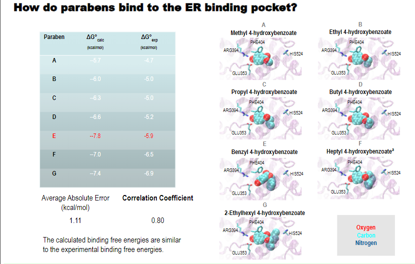

# Large-scale Binding Affinity Calculations of ER-Ligand Complexes: Assessment of the Predictive Power of Autodock Vina
## Borough of Manhattan Community College
### Muhammad Tanveer, Lauren Wickstrom, Sheila Sarkar

### Abstract
Estrogens are steroid molecules that promote and regulate cell and tissue growth. This growth becomes an issue when cells malfunction as seen in cancerous outcomes. Xenoestrogens also bind to the estrogen receptor (ER) and serve as key ingredients in widespread products. Experimental assays demonstrate that many xenoestrogens bind weakly to the ER; however, it is often unknown as to whether these compounds mimic the magnitude of the estrogen’s response. In our previous study, we used Autodock Vina to predict the binding affinity and poses of estradiol, triclosan and methylparaben in the ER binding pocket, which were in reasonable agreement with experiment. As a continuation of this work, we performed a large scale binding affinity survey of 171 xenoestrogens using Autodock Vina to assess the reliability of our computational predictions on a more diverse groups of ligands with different chemical function groups. The parabens produced the best results while the antiestrogens produced the worst results relative to experiment. Future work will focus on linking the chemical nature of these ligands to the accuracy of their computational models.

### You can view my [research poster](https://github.com/tanveerm176/CancerResearch/blob/main/BMCC_EstrogenParaben_ResearchPoster.pdf) or read the [final report](https://github.com/tanveerm176/CancerResearch/blob/main/CRSP%20Final%20Report.pdf) for a more comprehensive breakdown.

## Conclusion
* In this work, we report the results of 171 docking experiments of ER-ligand complexes. This work demonstrates that Autodock 
Vina has limitations as a computational tool for binding affinity predictions. Future work will focus on further examination of 
these results to understand the predictive power of Autodock Vina. 